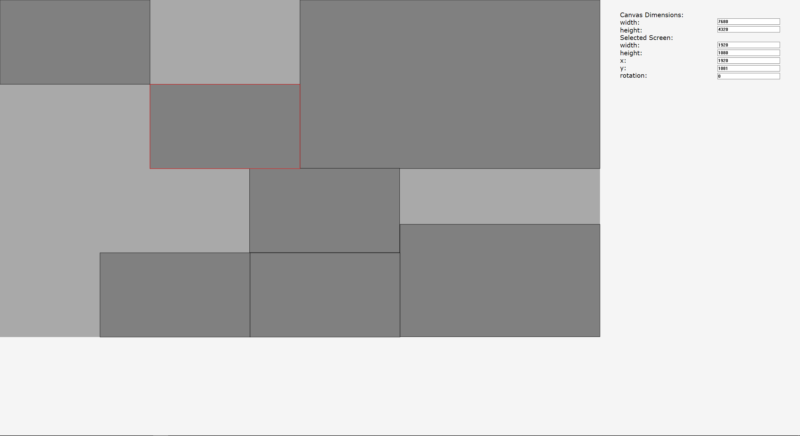

## General Info
This project is used to set up multiple screens on a canvas. Screens can be placed by clicking on the location and moved around by clicking down and dragging. A screen can be reselected by clicking on it, moved around with the arrow keys, deselected with the escape key, and removed with backspace or delete. The side panel can be used to modify the canvas dimensions along with the properties of the selected screen, such as its top left coordinates, width, height, and rotation.

This is a work in progress and all suggestions are welcome.

## 

This project was created in order to create an interface for placing monitors onto a wall. The monitor locations gathered could be exported and used in a display program. This offers more flexibility than the standard N by M monitor option which is still prevalent in many programs.

## Technology
Project is created with:
* C++
* Win32 API

## Setup
To run this project, the only option currently is to build it with Visual Studio.
